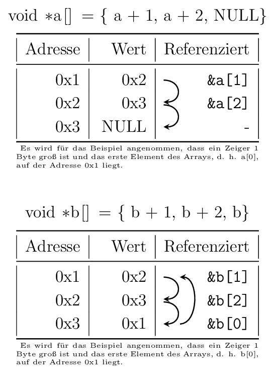
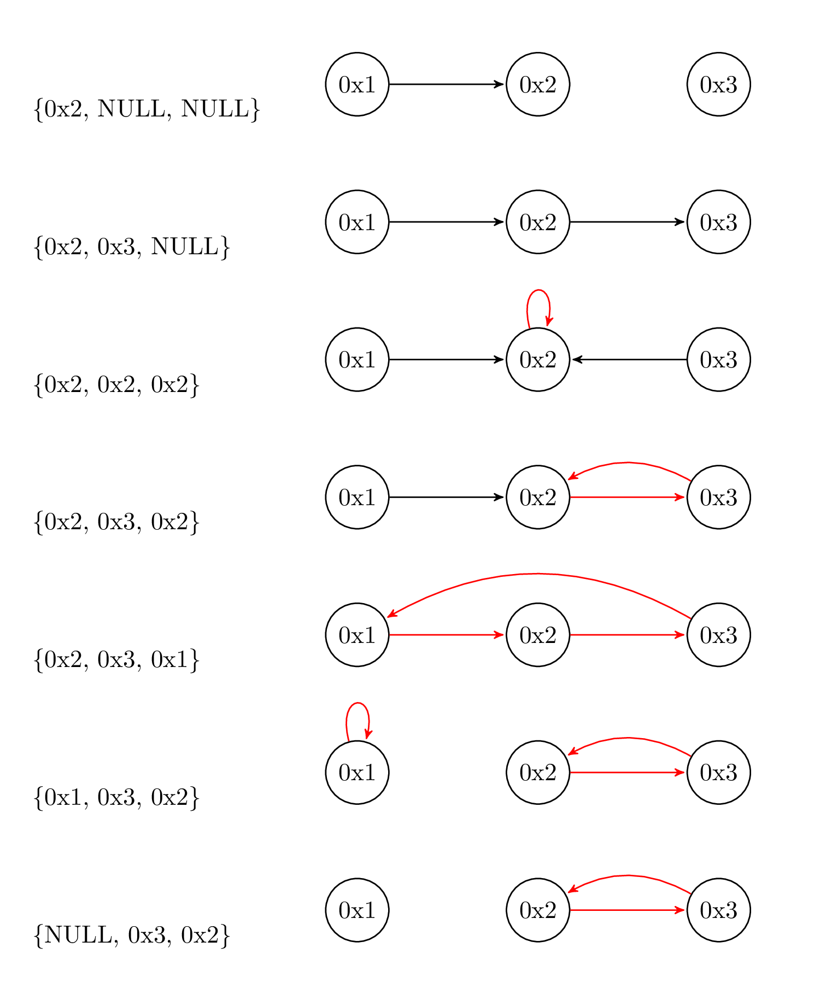

# Aufgabe 1 (5 Punkte)

## Vorlesungsfolien

* Zeiger (EidP-08-Zeiger.pdf)

## Beschreibung

Implementieren Sie in der Datei `s07e01.c` die Funktion mit der Signatur
`bool safe_add(const int *x, const int *y, int *result)`, welche die durch die Zeiger `x` und `y` referenzierten Werte
addiert. Sofern mindestens einer der drei Zeiger `x`, `y`, `result` ein `NULL`-Pointer ist oder beim Summieren ein
Überlauf oder ein Unterlauf auftreten würde, wird die Addition nicht durchgeführt und die Funktion gibt `false` zurück.
In jedem anderen Fall wird das berechnete Ergebnis in den Speicherbereich, auf welchen `result` zeigt, gespeichert und
der Wert `true` retourniert.

Testen Sie Ihre `safe_add`-Implementierung in der `main`-Funktion mit einigen Beispielaufrufen.

## Hinweis

Durch das Einbinden von `stdbool.h` steht Ihnen Konstanten für `true` und `false` sowie `bool` zur Verfügung.

# Aufgabe 2 (3 Punkte)

Analysieren Sie das Programm `s07e02.c` und bearbeiten Sie folgende Punkte:

- Erklären Sie die Deklarationen der Variablen `p1`, `p2`, `p3`, `p4` und `p5`. Falls es in diesen Zeilen zu
  Kompilierfehlern kommt beheben Sie diese durch Entfernen der überflüssigen Schlüsselworte.
- Sehen Sie sich die Zuweisungen in Zeile 13 bis 23 an. Falls es aufgrund einer dieser Zuweisungen zu Kompilierfehlern
  kommt kommentieren Sie die entsprechende Zeile aus und erklären Sie, warum die Zuweisung nicht erlaubt ist. Erklären
  Sie für die verbleibenden Zeilen warum die Zuweisung erlaubt ist.

# Aufgabe 3 (5 Punkte)

## Vorlesungsfolien

* Zeiger (EidP-08-Zeiger.pdf)

## Beschreibung

Implementieren Sie eine Funktion mit der Signatur `long sum(const int *start, const int *end)`, welche ausgehend vom
Pointer `start`, der auf das erste Element eines Arrays zeigt, alle Elemente bis zum Pointer `end` (inklusive), der auf
das letzte Element desselben Arrays zeigt, addiert und das Resultat zurückgibt.

Testen Sie Ihre `sum`-Implementierung in der `main` -Funktion mit einigen Beispielaufrufen.

# Aufgabe 4 (5 Punkte)

## Vorlesungsfolien

* Zeiger (EidP-08-Zeiger.pdf)

## Beschreibung

Gegeben sei das folgende Programm. Erklären bzw. begründen Sie die Ausgabe des Programms in der Datei `s07e04.txt`!

```c
#include <stdint.h>
#include <stdio.h>
#include <stdlib.h>
#include <string.h>

int main(void) {
    char values[] = "0123456789";
    char *p1 = values;
    char *p2 = values + strlen(values);
    printf("1. %c\n", *(p1 + 4));
    printf("2. %c\n", *p2);
    printf("3. %d\n", p1 < p2);
    printf("4. %d\n", (p1 + 2) < (p2 - 4));
    printf("5. %d\n", (((int32_t *)p1) + 2) < (int32_t *)(p2 - 4));
    printf("6. %td\n", p2 - p1);
    return EXIT_SUCCESS;
}

```

# Aufgabe 5 (5 Punkte)

## Vorlesungsfolien

* Zeiger (EidP-08-Zeiger.pdf)

## Beschreibung

Gegeben seien folgende Deklarationen.

```c
int matrix[5][6] = {{0}};
int *ptr = matrix[2] + 3;
```

Geben Sie für folgende Ausdrücke jeweils den Zeilen- und Spaltenindex des Elementes, auf welches zugegriffen wird, an,
indem Sie die Tabelle in der Datei `s07e05.txt` – analog zum bereits angeführten ersten Ausdruck `matrix[1][3]` –
vervollständigen.

1. `matrix[1][3]`
2. `*matrix[4]`
3. `*(matrix[4])`
4. `(*matrix)[4]`
5. `*(matrix[3] + 1)`
6. `**matrix + 5`
7. `*(*matrix + 2)`
8. `*(*(matrix + 1) + 4)`
9. `*(*matrix + 4) + 5`
10. `2 * *(ptr - 2) - 5`

# Aufgabe 6 (7 Punkte)

## Vorlesungsfolien

* Zeiger (EidP-08-Zeiger.pdf)

## Beschreibung

Implementieren Sie eine Funktion mit der Signatur `int contains_cycle(void *const array[], size_t length)`, welche
überprüft, ob die Elemente des Arrays `array`, die jeweils auf die Speicheradresse eines beliebigen Elements im
Array `array` oder auf `NULL` zeigen, einen sogenannten [Zyklus](https://en.wikipedia.org/wiki/Cycle_(graph_theory))
bilden. Dabei stellt die Adresse eines jeden Arrayelements den Startknoten $`a`$ und der Wert des Arrayelements, d.h.
die Adresse auf die gezeigt wird, den Endknoten $`b`$ einer Kante $`e = (a, b)`$ des Kantenzugs dar (vgl. auch
nachstehend angeführte Beispielgrafen). Sofern ein Zyklus gefunden wird, gibt die Funktion den Wert `1` zurück, in jedem
anderen Fall `0`.


## Beispiele

Bei den folgenden Beispielen wird zugunsten der Einfachheit der Veranschaulichung angenommen, dass das ein Zeiger $`1`$
Byte groß ist und das erste Element des Arrays, d. h. `array[0]`, auf der Speicheradresse `0x1` liegt.

|             `array` | `length` | `contains_cycle(array, length)` |
|--------------------:|---------:|--------------------------------:|
| `{0x2, NULL, NULL}` |      `3` |                             `0` |
|  `{0x2, 0x3, NULL}` |      `3` |                             `0` |
|   `{0x2, 0x2, 0x2}` |      `3` |                             `1` |
|   `{0x2, 0x3, 0x2}` |      `3` |                             `1` |
|   `{0x2, 0x3, 0x1}` |      `3` |                             `1` |
|   `{0x1, 0x3, 0x2}` |      `3` |                             `1` |
|  `{NULL, 0x3, 0x2}` |      `3` |                             `1` |

### Array Visualisierung


### Weitere Beispiele



## Hinweise

- Ein Zyklus ist in der [Graphentheorie](https://en.wikipedia.org/wiki/Graph_theory) ein
  [Kantenzug](https://en.wikipedia.org/wiki/Path_(graph_theory)) mit unterschiedlichen Kanten in einem Graphen, bei dem
  Start- und Endknoten gleich sind.
- Die Pointer im Beispiel dienen nur zur Illustration. Die konkreten Werte der Pointer können bei Ihrem Programmaufruf
  und beim Testen in Artemis dementsprechend abweichen.
