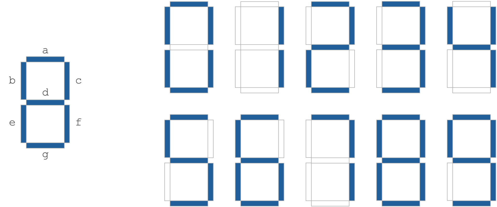
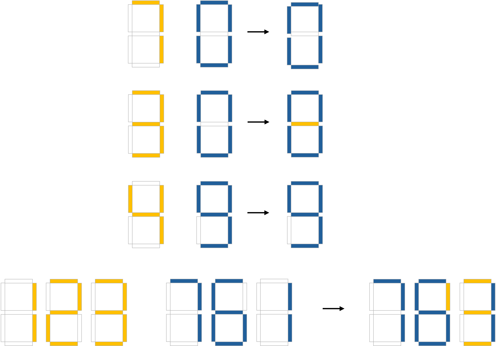

# Aufgabe 1 (7 Punkte)

## Vorlesungsfolien

* Dynamische Speicherverwaltung (EidP-11-DynamischeSpeicherverwaltung.pdf)
* Präprozessor (EidP-12-Praeprozessor.pdf)

## Beschreibung

Die folgende Aufgabe basiert auf dem Reddit-Post ["Invisibility of Digits"](https://www.reddit.com/r/mathmemes/comments/1jdgltw/invisibility_of_digits/?share_id=doWcfLaG5ohY1w09UgElZ&utm_content=1&utm_medium=android_app&utm_name=androidcss&utm_source=share&utm_term=3), in dem die neue "mathematische" Funktion **invisible by** ("unsichtbar durch") vorgeschlagen wird. Dabei wird auf die Darstellung der Ziffern 0-9 auf einem [7-Segment-Display](https://en.wikipedia.org/wiki/Seven-segment_display) zurückgegriffen:



Basierend darauf wird die Funktion wie folgt definiert:

Eine Zahl **a** ist **unsichtbar durch b**, wenn sie auf einem 7-Segment-Display durch b vollständig überdeckt wird.

Zum Beispiel gilt:
- 7 ist unsichtbar durch 0
- 3 ist nicht unsichtbar durch 0
- 4 ist unsichtbar durch 9
- 123 ist nicht unsichtbar durch 761



### Arbeitsschritte

Sehen Sie sich die bestehende Implementierung im gegebenen Template an. Darin wird jede Ziffer durch ein Array der Länge 7 definiert, welches den Segmenten `{a, b, c, d, e, f, g}` entspricht und `1` angegeben wird, falls das entsprechende Segment (siehe erstes Bild) angezeigt wird. Weiters wird ein globales 2-dimensionales Array `DIGITS` angelegt, wobei `DIGITS[0]` dem Array der Ziffer `0` entspricht, `DIGITS[1]` dem der Ziffer `1` usw. Schlussendlich wird die Funktion `print_number` bereitgestellt, welche eine gegebene positive Zahl als 7-Segment-Zahl auf der Konsole ausgibt und zu lokalen Testzwecken verwendet werden kann.


Implementieren Sie nun die folgenden Funktionen:

- `unsigned short *get_digits_reverse(unsigned long number, size_t *len)`: Legt über dynamische Speicherverwaltung ein neues Array an, in dem die einzelnen Ziffern einer übergebenen Zahl *in umgekehrter Reihenfolge* gespeichert werden und gibt dieses zurück. In der Variable `len` wird die Länge des erstellten Arrays gesetzt. Beispiel: `get_digits_reverse(1234, &len)` gibt das Array `{4, 3, 2, 1}` zurück und setzt `len = 4`.
- `_Bool digit_invisible_by(_Bool *digit_a, _Bool *digit_b)`: Überprüft, ob die Ziffer, die durch das Array `digit_a` dargestellt wird, unsichtbar durch das der Ziffer `digit_b` ist. Falls dem so ist, wird `1` zurückgegeben, ansonsten `0`.
- `_Bool invisible_by(unsigned long a, unsigned long b)`: Überprüft, ob die Zahl `a` unsichtbar durch die Zahl `b` ist und gibt `1` zurück, wenn dies der Fall ist, ansonsten `0`. Haben `a` und `b` unterschiedlich viele Ziffern, so soll auf jeden Fall `0` zurückgegeben werden. Verwenden Sie dazu die vorher implementierten Funktionen. Sie können davon ausgehen, dass sowohl `a` als auch `b` größer als 0 sind. 

### Wichtiger Hinweis

Aufgrund von technischen Einschränkungen in Artemis dürfen Sie den Header `stdbool.h` **nicht** verwenden! Verwenden Sie anstatt dessen wie angegeben den seit C99 verfügbaren Typ `_Bool` mit den Werten `0` und `1`.

# Aufgabe 2 (7 Punkte)

## Vorlesungsfolien

* Dynamische Speicherverwaltung (EidP-11-DynamischeSpeicherverwaltung.pdf)
* Ein-/Ausgabe (EidP-14-IO.pdf)

## Beschreibung

Ziel dieser Aufgabe ist es ein Programm zu erstellen, welches basierend auf einer Liste von Ganzzahlen vom
Datentyp `long` die Anzahl sowie das Minimum und das Maximum der in einer Datei aufgelisteten Werte bestimmt und diese
Kennzahlen im Format `count = <count>\nmin = <max>\nmax = <max>` auf der Standardausgabe ausgibt, wobei die
Platzhalter `<count>`, `<min>` und `<max>` durch die entsprechenden Werte ersetzt werden. Die einzelnen Werte, die die
Liste von Ganzzahlen bilden, stehen zeilenweise in einer Textdatei, deren Dateipfad als Kommandozeilenparameter
übergeben wird.

## Beispiele

### Beispiel 1

Inhalt der Eingabedatei `s10e02-in1.txt`:

```text
7
3
-4
9
-7
```

Aufruf und Ausgabe:

```text
./s10e02 s10e02-in1.txt
count = 5
min = -7
max = 9
```

### Beispiel 2

Inhalt der Eingabedatei `s10e02-in2.txt`:

```text
20
12
19
```

Aufruf und Ausgabe:

```text
./s10e02 s10e02-in2.txt
count = 3
min = 12
max = 20
```

# Aufgabe 3 (6 Punkte)

## Vorlesungsfolien

* Ein-/Ausgabe (EidP-14-IO.pdf)

## Beschreibung

Implementieren Sie eine Funktion mit der Signatur `int write_n(const char *src_path, const char *dst_path, int n)`, welche
die Eingabedatei, welche durch den Pfad `src_path` angegeben wird, zeilenweise einliest und jede $`\mathtt{n}`$-te Zeile,
$`\mathtt{n} > 0`$, in die Ausgabedatei, welche durch den Pfad `dst_path` angegeben wird, schreibt. Für das Einlesen der
Eingabedatei kann angenommen werden, dass keine Zeile der Eingabedatei länger als $`80`$ Zeichen ist. Sofern für `n` eine
Zahl übergeben wird, welche kleiner als $`1`$ ist, retourniert die Funktion `-1`, ohne zuvor in die Ausgabedatei zu schreiben
bzw. – sollte diese noch nicht existiert – sie zu erstellen.

Überlegen Sie sich welche Fehlerfälle beim Arbeiten mit den Dateien auftreten können und geben Sie für jeden dieser
Fehlerfälle eine andere negative Zahl an das die Funktion `write_n` aufrufende Programm zurück. Dokumentieren Sie die
Bedeutung aller Rückgabewerte in einem Kommentar vor der Funktionssignatur. Wenn die Funktion `write_n` ohne Fehler
ausgeführt wird, retourniert sie den Wert `0`.

Testen Sie Ihre `write_n`-Implementierung in der `main` -Funktion mit einigen Beispielaufrufen.

## Hinweise

- Achten Sie darauf, dass Sie alle Ressourcen, die sie allozieren, freigeben.
- `fgets` und `fprintf` können beim Lesen von Dateien bzw. Schreiben in Dateien hilfreich sein.
- Sollte die Eingabedatei nicht mindestens `n` Zeilen haben, wird nichts in die Ausgabedatei geschrieben.

# Aufgabe 4 (10 Punkte)

## Vorlesungsfolien

* Dynamische Speicherverwaltung (EidP-11-DynamischeSpeicherverwaltung.pdf)
* Ein-/Ausgabe (EidP-14-IO.pdf)

## Beschreibung

Ziel dieser Aufgabe ist es ein Programm zu erstellen, welches basierend auf der Beschreibung einer Route, welche vom
[Mars-Rover](https://en.wikipedia.org/wiki/Mars_rover) zurückgelegt wurde, den gefahrenen Pfad auf einer
zweidimensionalen Marskarte einzeichnet und die Marskarte auf der Standardausgabe ausgibt. Die Beschreibung der Route
wird über eine Datei, deren Dateipfad als Kommandozeilenparameter übergeben wird, bereitgestellt.

Das Format der Eingabedatei hat folgende Struktur:

```text
width = <width>
height = <height>
x = <x>
y = <y>

<Path description>
```

Durch die Platzhalter werden die folgenden Informationen der Route angegeben:

- `<width>` und `<height>`: Breite und Höhe der genordeten Marskarte.
- `<x>` und `<y>`: $`x`$-Koordinate und $`y`$-Koordinate der Startposition. An der Startposition ist der Mars-Rover
  immer nach Norden ausgerichtet.
- `<Path description>`: Wegbeschreibung des Pfads, welche sich aus drei möglichen Aktionen zusammensetzt:
    - `L`: Linksdrehung um $`90`$ Grad.
    - `R`: Rechtsdrehung um $`90`$ Grad.
    - `S<n>`: $`n`$-Schritte geradeaus in die Himmelsrichtung, in welche der Mars-Rover momentan ausgerichtet ist.

Sie können davon ausgehen, dass die spezifizierten Dimensionen `<width>` und `<height>` der Marskarte ausreichend sind,
um – ausgehend von der Startposition $`(\mathtt{x}, \mathtt{y})`$ – die gesamte Route einzutragen. Als Pfadsymbol soll
das Zeichen `'O'` verwendet werden. Für eine Position, welche nicht besucht wird, soll ein Leerzeichen (`' '`)
ausgegeben werden.

## Beispiele

### Beispiel 1

Inhalt der Eingabedatei `s10e04-in1.txt`:

```text
width = 6
height = 2
x = 4
y = 1

```

Aufruf und Ausgabe:

```text
./s10e04 s10e04-in1.txt
      
    O 
```

### Beispiel 2

Inhalt der Eingabedatei `s10e04-in2.txt`:

```text
width = 21
height = 11
x = 0
y = 0

R
S20
R
S10
R
S20
R
S8
```

Aufruf und Ausgabe:

```text
./s10e04 s10e04-in2.txt
OOOOOOOOOOOOOOOOOOOOO
                    O
O                   O
O                   O
O                   O
O                   O
O                   O
O                   O
O                   O
O                   O
OOOOOOOOOOOOOOOOOOOOO
```

### Beispiel 3

Inhalt der Eingabedatei `s10e04-in3.txt`:

```text
width = 21
height = 11
x = 20
y = 0

L
S20
L
S10
L
S20
L
S8
L
S18
L
S6
L
S16
L
S4
L
S14
L
S2
L
S12
```

Aufruf und Ausgabe:

```text
./s10e04 s10e04-in3.txt
OOOOOOOOOOOOOOOOOOOOO
O                    
O OOOOOOOOOOOOOOOOOOO
O O                 O
O O OOOOOOOOOOOOOOO O
O O O             O O
O O OOOOOOOOOOOOO O O
O O               O O
O OOOOOOOOOOOOOOOOO O
O                   O
OOOOOOOOOOOOOOOOOOOOO
```
